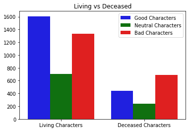

# Taehyung Kim Data Science Portfolio
## Hello! My name is Taehyung and this is my Portfolio Github Page with some of my interesting Data Science projects.

# [Project 1: What is the Fate of Marvel Heroes?](https://github.com/taehyungkim1995/What-is-the-Fate-of-Marvel-Heroes-/blob/master/README.md)

* Compared different binary classification methods to most accurately predict whether Marvel Heroes live or meet their demise using Marvel Wiki Dataset
* Analyzed different characteristics of Marvel Heroes, such as total number of appearances and identity by alignment
* Implemented one-hot encoding, label encoding, and standardization of data in order to fit dataset into classification models
* Visualized accuracy score results for classification models to communicate and document results

# [Project 2: How Many Goals will be Scored?](https://github.com/taehyungkim1995/How-Many-Goals-will-be-Scored-/blob/master/README.md)

* Evaluated different regression methods to accurately predict the total number of goals scored in a soccer game for the Premier League and EFL Championship
* Analyzed and visualized proportion of matches that results in wins, ties, and losses for home/away teams, distribution of goals per match, and correlation between betting odds
* Utilized train/test split and k-fold cross validation methods to effectively test models and respond to potential overfitting issues 
* Measured mean squared error values of each regression model to choose the most accurately predictive model 

# [Project 3: How Are Main Player Attributes Related in FIFA?](https://github.com/taehyungkim1995/How-are-Main-Player-Attributes-Related-in-Fifa-)

* Applied multiple linear regression to analyze how main player attributes are related to the overall player statistic in the video game FIFA 20
* Analyzed the correlation coefficients between player statistics (e.g defending, passing, dribbling with overall) and visualized the distribution of the overall statistic 
* Visualized results to how well the test data fit the predicted values and used metrics such as R-squared values, mean-squared error, and residual plot
