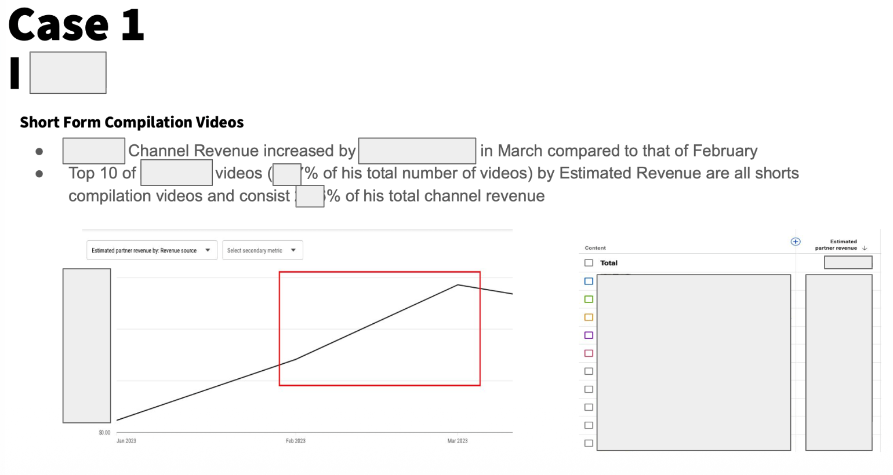
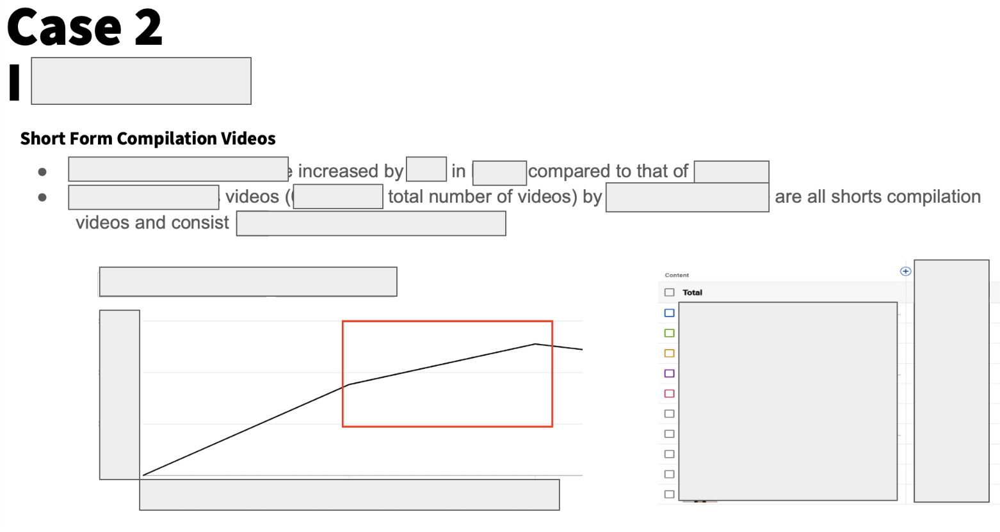
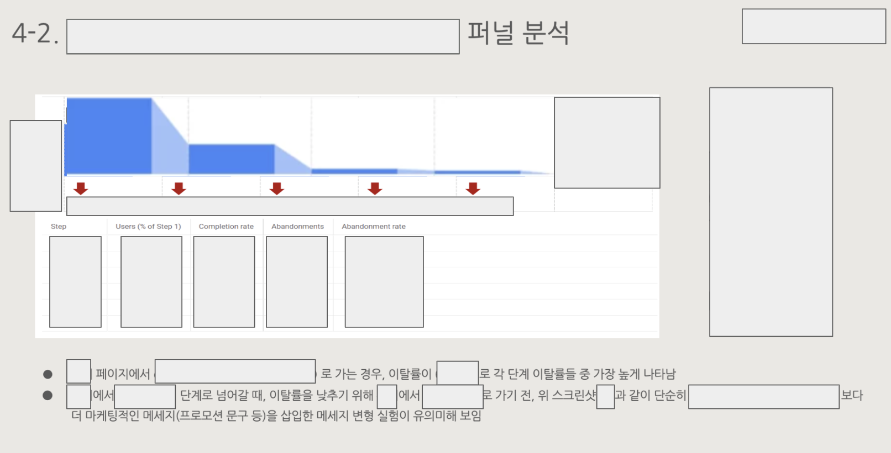
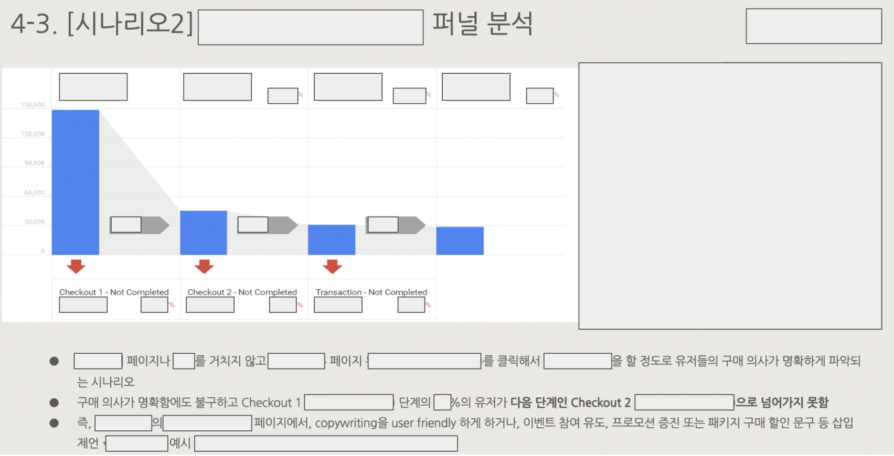
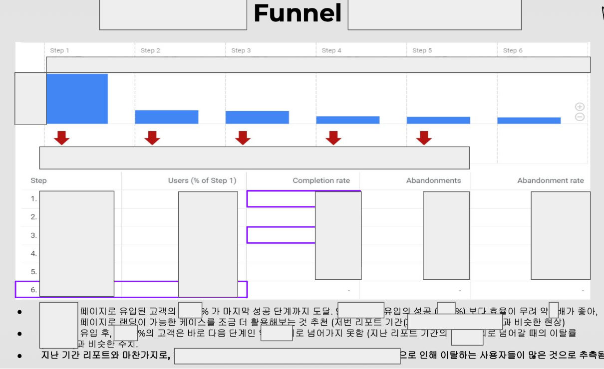
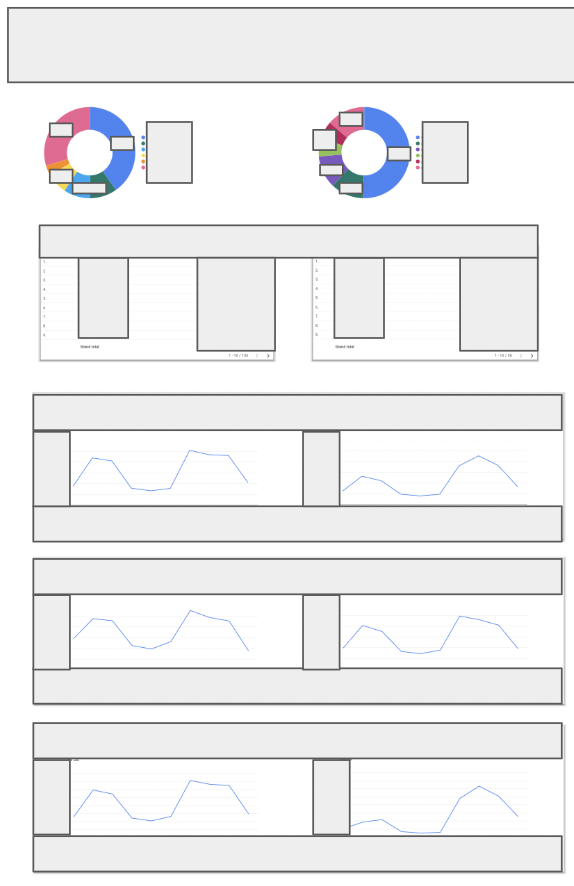
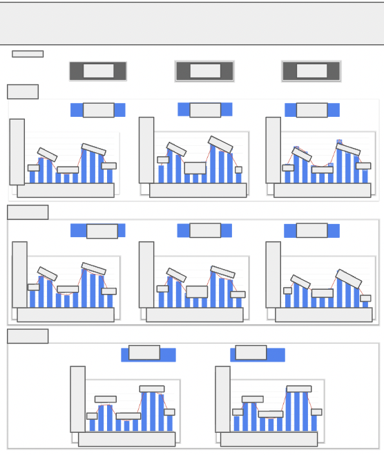
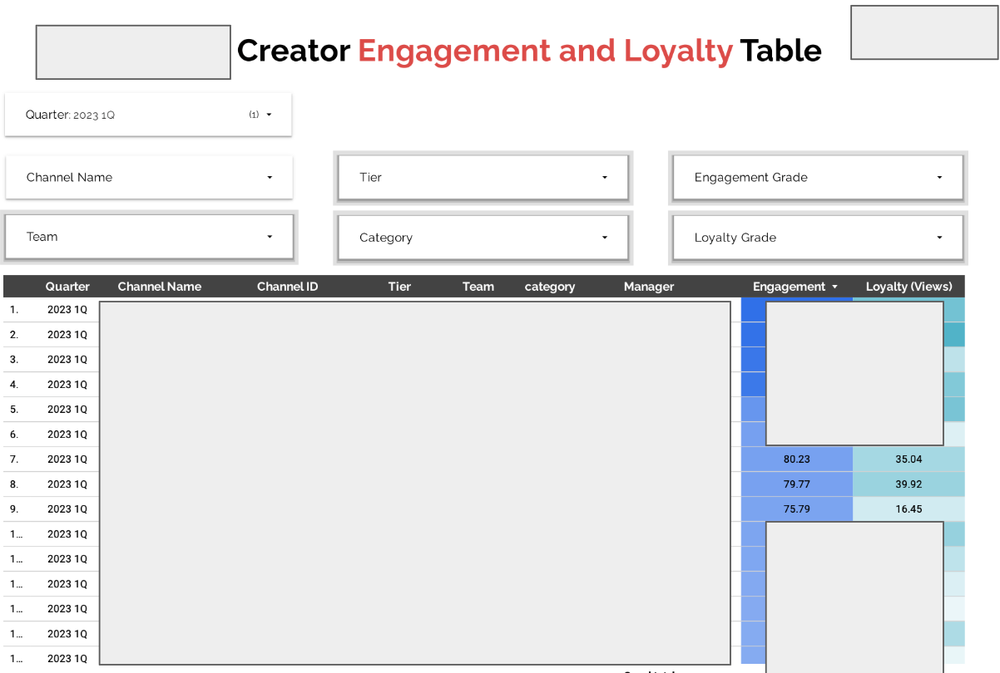
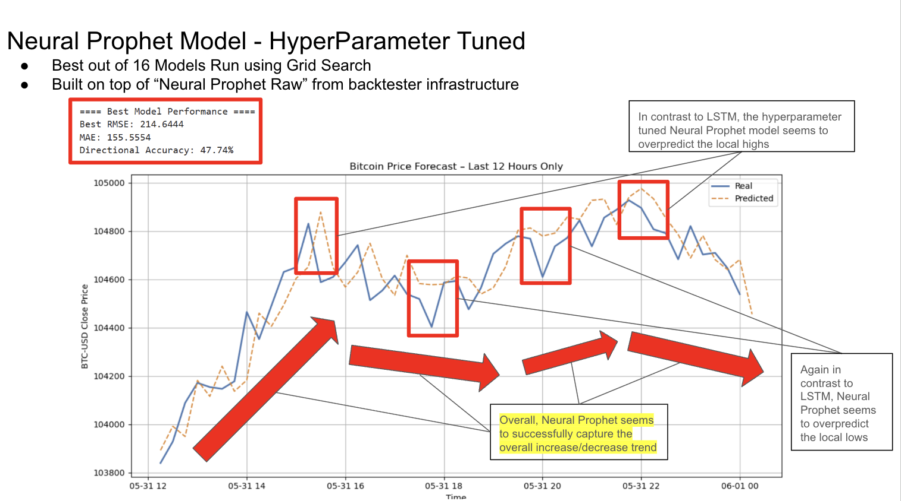
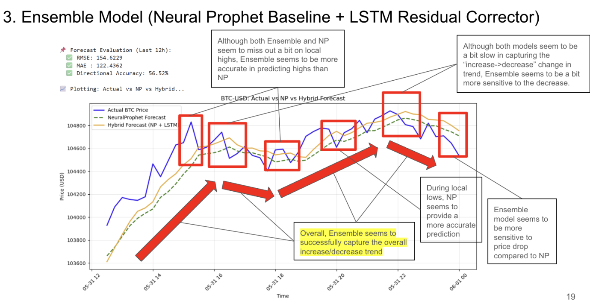

# Taehyung Kim Data Science Portfolio 
## Welcome! My name is Taehyung and this is my Data Science Project Portfolio. For the Personal Projects, please click on the topics of each project to read more.

## Table of Contents

- [Part 1. Professional Projects (실무 프로젝트)](#part-1-professional-projects-실무-프로젝트)
  - [Project 1. YouTube Shorts Performance Analysis](#project-1-youtube-shorts-performance-analysis)
  - [Project 2. Funnel Analysis for Conversion Optimization](#project-2-funnel-analysis-for-conversion-optimization)
  - [Project 3. Improving Loan Conversion with Funnel Analysis](#project-3-improving-loan-conversion-with-funnel-analysis)
  - [Project 4. Improving Merchandise Sales Performance with Engagement Data Analysis](#project-4-improving-merchandise-sales-performance-with-engagement-data-analysis)
  - [Project 5. Bitcoin Price Prediction using Time Series Models](#project-5-bitcoin-price-prediction-using-time-series-models)

- [Part 2. Personal Projects (개인 프로젝트)](#part-2-personal-projects-개인-프로젝트)
  - [Project 1: What is the Fate of Marvel Heroes?](#project-1-what-is-the-fate-of-marvel-heroes)
  - [Project 2: Using Regression Methods to Predict and Estimate the Number of Goals Conceded](#project-2-using-regression-methods-to-predict-and-estimate-the-number-of-goals-conceded)
  - [Project 3: Using K Means Clustering to Analyze and Group Top European Football Teams](#project-3-using-k-means-clustering-to-analyze-and-group-top-european-football-teams)
  - [Project 4: How Many Goals will be Scored?](#project-4-how-many-goals-will-be-scored)
  - [Project 5: How Are Main Player Attributes Related in FIFA?](#project-5-how-are-main-player-attributes-related-in-fifa)

# Part 1. Professional Projects (실무 프로젝트)

Professional projects are presented without source code or proprietary metrics in compliance with NDA agreements. Focus is on methodology, impact, and technical approach.

# Project 1. YouTube Shorts Performance Analysis

Note: Implementation details are abstracted due to NDA

* Defined the problem of unclear YouTube Shorts revenue contribution after Shorts monetization
* Analyzed YouTube Shorts views and revenue using YouTube Analytics and BigQuery
* Identified that Shorts contributed over 20% of total channel revenue
* Achieved 14% growth in total number of views and 4% revenue increase through a Shorts-focused content strategy
  
[한글 요약]
- Shorts 수익화 이후 수익 기여도 기준이 불명확한 문제 정의
- YouTube Analytics 및 BigQuery 기반 Shorts 조회수 및 수익 분석
- Shorts가 채널 전체 수익의 20% 이상 기여하는 구조 확인
- Shorts 콘텐츠 생성 중심 전략으로 총 채널 조회수 14%, 총 채널 수익 4% 성장

# Project 2. Funnel Analysis for Conversion Optimization 

Note: Implementation details are abstracted due to NDA

* Defined user funnel and analyzed user behavior for a major Korean online content service company using Google Analytics (buyer vs non-buyer user segmentation)
* Identified key drop-offs: 24% at early payment stage, 14% at final payment stage
* Derived user interface and checkout process improvements to reduce customer drop-off rates
* Contributed to client retention with a contract renewal through data-driven insights
  
[한글 요약]
- 전환 퍼널을을 통해 사용자 이탈 구간 분석
- Google Analytics 기반 서비스 내 구매자/비구매자 행동 패턴 분석
- 결제 전 단계 24%, 최종 결제 단계 14% 등 사용자 주요 이탈 구간 식별
- 유저 인터페이스 및 결제 프로세스 개선 방향 도출
- 데이터 기반 인사이트 제공으로 고객사 재계약 성사

# Project 3. Improving Loan Conversion with Funnel Analysis

Note: Implementation details are abstracted due to NDA

* Defined end-to-end loan application funnel using Google Analytics for a major financial loan service company in Korea
* Identified major user drop-offs such as 70% at the initial page and low overall conversion of 6~7% of total users
* Analyzed user flow and discovered bottlenecks across key steps such as input stages and authentication stages
* Proposed UX and process improvements to optimize user conversion
* Developed Looker Studio dashboards to analyze user behavior, providing actionable insights for service optimization

[한글 요약]
- Google Analytics 기반 대출 신청 전환 퍼널 정의 및 분석
- 초기 단계 70% 고객 이탈률 및 전체 전환율 약 6~7% 수준 문제 식별
- 본인 인증 및 정보 입력 단계 등 주요 병목 구간 분석
- UX 개선 및 프로세스 간소화를 통한 전환율 개선 방향 도출
- 사용자 행동 분석을 위한 Looker Studio 대시보드 구축 및 서비스 최적화 인사이트 도출

# Project 4. Improving Merchandise Sales Performance with Engagement Data Analysis

Note: Implementation details are abstracted due to NDA

* Identified inefficiency in merchandise strategy that focuses on creators with the most views
* As an alternative, collected and analyzed viewer engagement metrics involving likes and comments ratio per view
* Found strong correlation between engagement metrics and merchandise sales performance
* Developed viewer engagement based targeting strategy for creator merchandise sales
* Reduced merchandise related costs by approximately $50,000 using the new engagement metric
  
[한글 요약]
- 조회수 중심 크리에이터 굿즈 판매 전략의 비효율성 발견
- 단순 조회수 대신 좋아요, 댓글 등을 사용한 Engagement 지표 개발
- Engagement 지표와 크리에이터 굿즈 판매 성과 간 높은 상관관계 확인
- Engagement 지표 기반 크리에이터 타기팅 전략 수립
- 크리에이터 굿즈 판매 비용 약 $50,000 절감

# Project 5. Bitcoin Price Prediction using Time Series Models

Note: Implementation details are abstracted due to NDA
* Built a time series model to predict short-term Bitcoin prices using historical data
* Applied LSTM and NeuralProphet time series models using Bitcoin closing price
* Evaluated time series model performance using RMSE, MAE, MAPE 
* Achieved improved short-term prediction performance with deep learning models

[한글 요약]
- 과거 비트코인 가격 데이터를 기반으로 단기 가격 예측 모델 구축
- LSTM/Neural Prophet 모델 등 적용하여 비트코인 단기 종가 예측 
- RMSE, MAE, MAPE 등 시계열 모델 성능 평가 지표 이용
- 딥러닝 모델이 단기 가격 예측에서 더 성능이 높은 경향을 보임

# Part 2. Personal Projects (개인 프로젝트) 

# [Project 1: What is the Fate of Marvel Heroes?](https://github.com/taehyungkim1995/What-is-the-Fate-of-Marvel-Heroes-/blob/master/README.md)

* Compared different binary classification methods to most accurately predict whether Marvel Heroes live or meet their demise using Marvel Wiki Dataset
* Analyzed different characteristics of Marvel Heroes, such as total number of appearances and identity by alignment
* Implemented one-hot encoding, label encoding, and standardization of data in order to fit dataset into classification models
* Visualized accuracy score results for classification models to communicate and document results

[한글 요약]
- 마블 히어로의 생존 여부를 예측하는 이진 분류 문제를 정의
- 다양한 분류 모델(Logistic Regression, Random Forest 등)을 비교하여 모델 성능 평가 및 비교
- 히어로 등장 횟수, alignment 등이 주요 변수로 작용하는 것을 발견
- 분류 예측 모델 비교 및 변수 중요도 분석 등 경험

# [Project 2: Using Regression Methods to Predict and Estimate the Number of Goals Conceded](https://github.com/taehyungkim1227/Using-Regression-Methods-to-Predict-and-Estimate-the-Number-of-Goals-Conceded)

* Applied multiple linear regression, ridge regression, lasso regression, and polynomial regression in order to analyze how the number of goals conceded per game per team could be estimated
* Performed exploratory analysis on correlation of each variable and how each variable is distributed (shots per game, shots on target per game, dribbles per game, number of times fouled per game)
* Analyzed coefficients (OLS) and lambda values (ridge, lasso) for each model to dive deeper into each model performance

[한글 요약]
- 축구 팀의 경기당 실점 수를 예측하는 회귀 문제를 정의하였음
- Linear / Ridge / Lasso / Polynomial Regression 등 다수 회귀 모델 성능 비교
- 변수 간 상관관계 및 분포 분석을 통한 EDA 수행
- 회귀 모델 비교 및 과적합 방지를 위한 정규화 기법 (Ridge, Lasso 등) 적용 경험

# [Project 3: Using K Means Clustering to Analyze and Group Top European Football Teams](https://github.com/taehyungkim1227/Using-K-Means-Clustering-to-Analyze-and-Group-Top-European-Football-Teams)

* Used K-means clustering to categorize soccer teams in Europe's top 3 domestic leagues
* Analyzed the characteristics (play style and league performances) of each category based on number of shots per game and goals conceded per game
* Visualized each cluster to gain a deeper understanding of each team and analyze team performances

[한글 요약]
- 유럽 축구팀을 플레이 스타일 기반으로 그룹화하는 클러스터링 문제를 정의
- K-means를 활용하여 팀들을 여러 군집으로 분류
- 팀별 총 슈팅 수, 실점 수 등 경기 지표를 기반으로 클러스터 특성 분석
- 클러스터링 기반 데이터 그룹화 및 특성 분석 경험

# [Project 4: How Many Goals will be Scored?](https://github.com/taehyungkim1995/How-Many-Goals-will-be-Scored-/blob/master/README.md)

* Evaluated different regression methods to accurately predict the total number of goals scored in a soccer game for the Premier League and EFL Championship
* Analyzed and visualized proportion of matches that results in wins, ties, and losses for home/away teams, distribution of goals per match, and correlation between betting odds
* Utilized train/test split and k-fold cross validation methods to effectively test models and respond to potential overfitting issues 
* Measured mean squared error values of each regression model to choose the most accurately predictive model

[한글 요약]
- 경기당 총 득점수를 예측하는 회귀 문제 정의
- 다양한 회귀 모델과 cross-validation을 통해 성능 비교
- MSE를 기준으로 모델 평가 및 비교
- 모델 검증 및 성능 개선 경험

# [Project 5: How Are Main Player Attributes Related in FIFA?](https://github.com/taehyungkim1995/How-are-Main-Player-Attributes-Related-in-Fifa-)

* Applied multiple linear regression to analyze how main player attributes are related to the overall player statistic in the video game FIFA 20
* Analyzed the correlation coefficients between player statistics (e.g defending, passing, dribbling with overall) and visualized the distribution of the overall statistic 
* Visualized results to how well the test data fit the predicted values and used metrics such as R-squared values, mean-squared error, and residual plot

[한글 요약]
- FIFA 선수 능력치가 overall rating에 미치는 영향 분석
- 다중 선형 회귀를 통해 변수 간 관계 및 영향력 분석
- 상관관계 및 모델 성능 지표(R², MSE 등) 활용
- 회귀 기반 변수 해석 및 영향도 분석 경험

