# Taehyung Kim Data Science Portfolio 
## Welcome! My name is Taehyung and this is my Data Science Project Portfolio Page. Please click on the topics of each project to read more.

# [Project 1: What is the Fate of Marvel Heroes?](https://github.com/taehyungkim1995/What-is-the-Fate-of-Marvel-Heroes-/blob/master/README.md)

* Compared different binary classification methods to most accurately predict whether Marvel Heroes live or meet their demise using Marvel Wiki Dataset
* Analyzed different characteristics of Marvel Heroes, such as total number of appearances and identity by alignment
* Implemented one-hot encoding, label encoding, and standardization of data in order to fit dataset into classification models
* Visualized accuracy score results for classification models to communicate and document results

[한글 요약]
- 마블 히어로의 생존 여부를 예측하는 이진 분류 문제를 정의
- 다양한 분류 모델(Logistic Regression, Random Forest 등)을 비교하여 모델 성능 평가 및 비교
- 히어로 등장 횟수, alignment 등이 주요 변수로 작용하는 것을 발견
- 분류 예측 모델 비교 및 변수 중요도 분석 등 경험

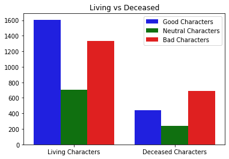
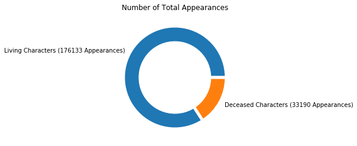
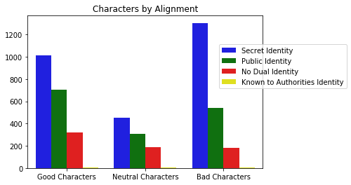
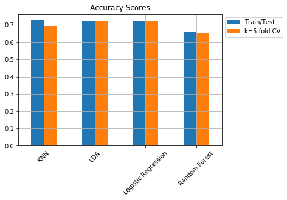

# [Project 2: Using Regression Methods to Predict and Estimate the Number of Goals Conceded](https://github.com/taehyungkim1227/Using-Regression-Methods-to-Predict-and-Estimate-the-Number-of-Goals-Conceded)

* Applied multiple linear regression, ridge regression, lasso regression, and polynomial regression in order to analyze how the number of goals conceded per game per team could be estimated
* Performed exploratory analysis on correlation of each variable and how each variable is distributed (shots per game, shots on target per game, dribbles per game, number of times fouled per game)
* Analyzed coefficients (OLS) and lambda values (ridge, lasso) for each model to dive deeper into each model performance

[한글 요약]
- 축구 팀의 경기당 실점 수를 예측하는 회귀 문제를 정의하였음
- Linear / Ridge / Lasso / Polynomial Regression 등 다수 회귀 모델 성능 비교
- 변수 간 상관관계 및 분포 분석을 통한 EDA 수행
- 회귀 모델 비교 및 과적합 방지를 위한 정규화 기법 (Ridge, Lasso 등) 적용 경험

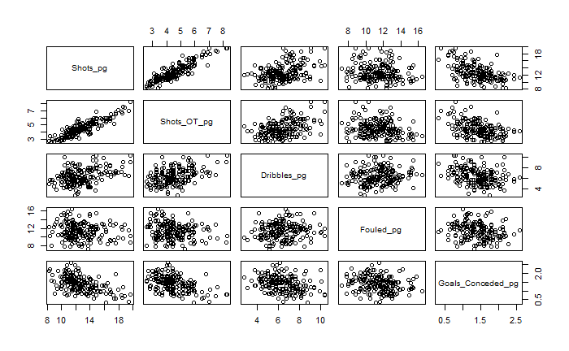
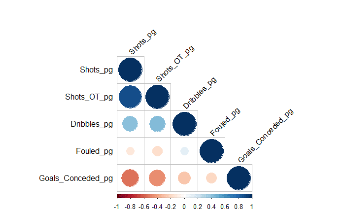
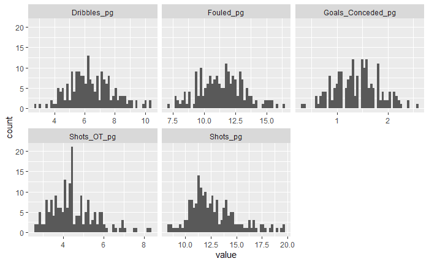
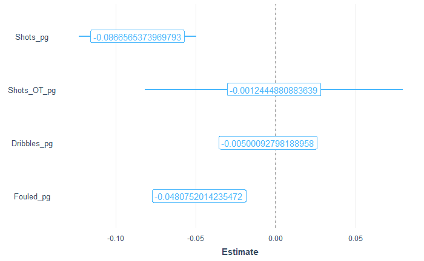
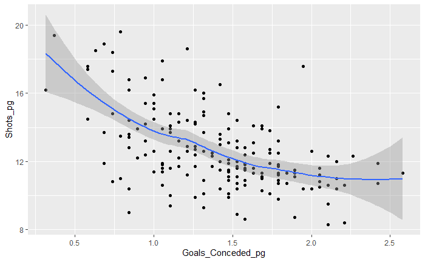

# [Project 3: Using K Means Clustering to Analyze and Group Top European Football Teams](https://github.com/taehyungkim1227/Using-K-Means-Clustering-to-Analyze-and-Group-Top-European-Football-Teams)

* Used K-means clustering to categorize soccer teams in Europe's top 3 domestic leagues
* Analyzed the characteristics (play style and league performances) of each category based on number of shots per game and goals conceded per game
* Visualized each cluster to gain a deeper understanding of each team and analyze team performances

[한글 요약]
- 유럽 축구팀을 플레이 스타일 기반으로 그룹화하는 클러스터링 문제를 정의
- K-means를 활용하여 팀들을 여러 군집으로 분류
- 팀별 총 슈팅 수, 실점 수 등 경기 지표를 기반으로 클러스터 특성 분석
- 클러스터링 기반 데이터 그룹화 및 특성 분석 경험

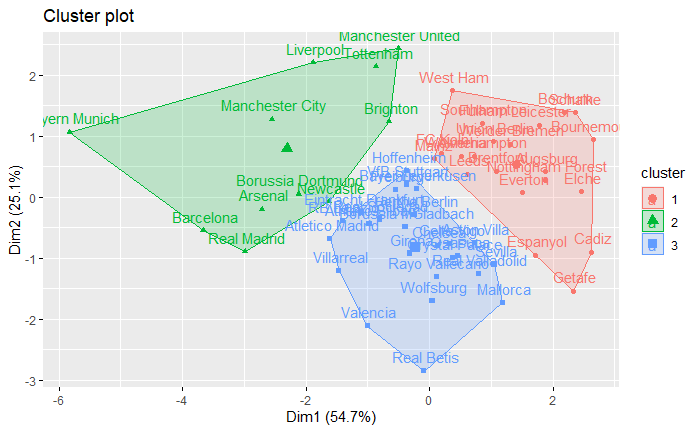
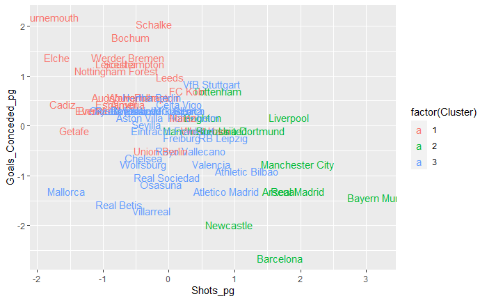
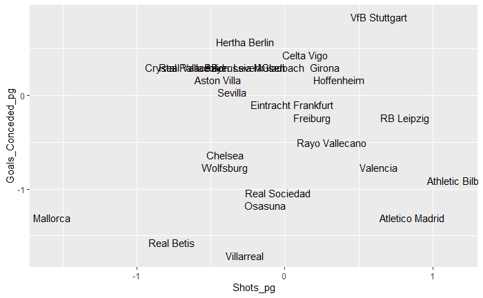

# [Project 4: How Many Goals will be Scored?](https://github.com/taehyungkim1995/How-Many-Goals-will-be-Scored-/blob/master/README.md)

* Evaluated different regression methods to accurately predict the total number of goals scored in a soccer game for the Premier League and EFL Championship
* Analyzed and visualized proportion of matches that results in wins, ties, and losses for home/away teams, distribution of goals per match, and correlation between betting odds
* Utilized train/test split and k-fold cross validation methods to effectively test models and respond to potential overfitting issues 
* Measured mean squared error values of each regression model to choose the most accurately predictive model

[한글 요약]
- 경기당 총 득점수를 예측하는 회귀 문제 정의
- 다양한 회귀 모델과 cross-validation을 통해 성능 비교
- MSE를 기준으로 모델 평가 및 비교
- 모델 검증 및 성능 개선 경험

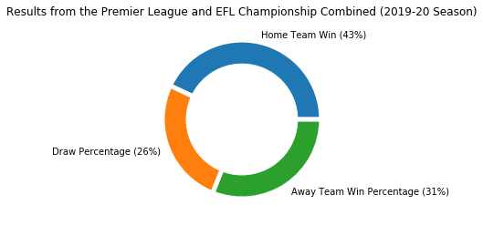
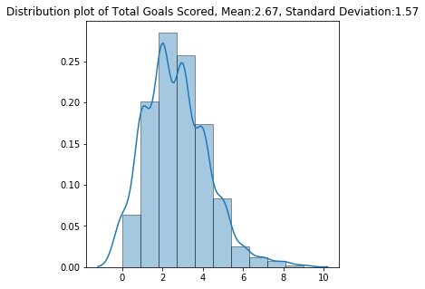
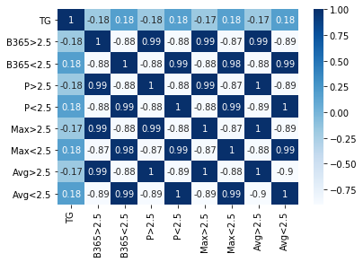
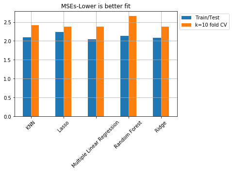

# [Project 5: How Are Main Player Attributes Related in FIFA?](https://github.com/taehyungkim1995/How-are-Main-Player-Attributes-Related-in-Fifa-)

* Applied multiple linear regression to analyze how main player attributes are related to the overall player statistic in the video game FIFA 20
* Analyzed the correlation coefficients between player statistics (e.g defending, passing, dribbling with overall) and visualized the distribution of the overall statistic 
* Visualized results to how well the test data fit the predicted values and used metrics such as R-squared values, mean-squared error, and residual plot

[한글 요약]
- FIFA 선수 능력치가 overall rating에 미치는 영향 분석
- 다중 선형 회귀를 통해 변수 간 관계 및 영향력 분석
- 상관관계 및 모델 성능 지표(R², MSE 등) 활용
- 회귀 기반 변수 해석 및 영향도 분석 경험

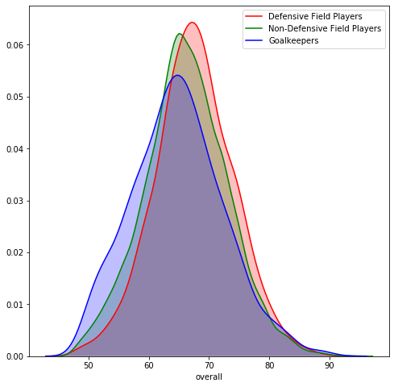

