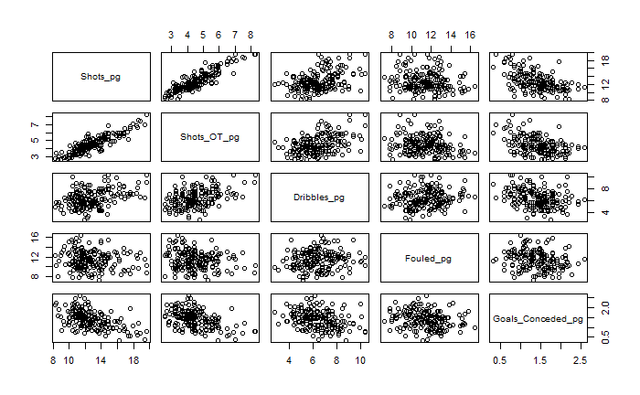

# Taehyung Kim Data Science Portfolio
## Welcome! My name is Taehyung and this is my Data Science Project Portfolio Page. Please click on the topics of each project to read more.

# [Project 1: What is the Fate of Marvel Heroes?](https://github.com/taehyungkim1995/What-is-the-Fate-of-Marvel-Heroes-/blob/master/README.md)

* Compared different binary classification methods to most accurately predict whether Marvel Heroes live or meet their demise using Marvel Wiki Dataset
* Analyzed different characteristics of Marvel Heroes, such as total number of appearances and identity by alignment
* Implemented one-hot encoding, label encoding, and standardization of data in order to fit dataset into classification models
* Visualized accuracy score results for classification models to communicate and document results

# [Project 2: Using Regression Methods to Predict and Estimate the Number of Goals Conceded](https://github.com/taehyungkim1227/Using-Regression-Methods-to-Predict-and-Estimate-the-Number-of-Goals-Conceded)

* Applied multiple linear regression, ridge regression, lasso regression, and polynomial regression in order to analyze how the number of goals conceded per game per team could be estimated
* Performed exploratory analysis on correlation of each variable and how each variable is distributed (shots per game, shots on target per game, dribbles per game, number of times fouled per game)
* Analyzed coefficients (OLS) and lambda values (ridge, lasso) for each model to dive deeper into each model performance

# [Project 3: Using K Means Clustering to Analyze and Group Top European Football Teams](https://github.com/taehyungkim1227/Using-K-Means-Clustering-to-Analyze-and-Group-Top-European-Football-Teams)

* Used K-means clustering to categorize soccer teams in Europe's top 3 domestic leagues
* Analyzed the characteristics (play style and league performances) of each category based on number of shots per game and goals conceded per game
* Visualized each cluster to gain a deeper understanding of each team and analyze team performances

# [Project 4: How Many Goals will be Scored?](https://github.com/taehyungkim1995/How-Many-Goals-will-be-Scored-/blob/master/README.md)

* Evaluated different regression methods to accurately predict the total number of goals scored in a soccer game for the Premier League and EFL Championship
* Analyzed and visualized proportion of matches that results in wins, ties, and losses for home/away teams, distribution of goals per match, and correlation between betting odds
* Utilized train/test split and k-fold cross validation methods to effectively test models and respond to potential overfitting issues 
* Measured mean squared error values of each regression model to choose the most accurately predictive model 

# [Project 5: How Are Main Player Attributes Related in FIFA?](https://github.com/taehyungkim1995/How-are-Main-Player-Attributes-Related-in-Fifa-)

* Applied multiple linear regression to analyze how main player attributes are related to the overall player statistic in the video game FIFA 20
* Analyzed the correlation coefficients between player statistics (e.g defending, passing, dribbling with overall) and visualized the distribution of the overall statistic 
* Visualized results to how well the test data fit the predicted values and used metrics such as R-squared values, mean-squared error, and residual plot

